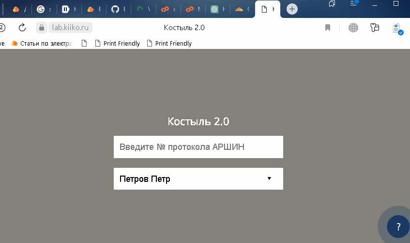

# Костыль 2.0
Данный репозиторий содержит скрипт для генерации XML-файла с данными поверок из АРШИН.

## Установка

1. Арендуйте веб-хостинг за ~150 рублей (рекомендую ihor на cPanel).
2. Скачайте скрипт из репозитория и загрузите его на веб-хостинг.
3. В личном кабинете АРШИНА создайте токен.
4. В конфигурационном файле скрипта 'config.php' пропишите токен.
5. В файле 'metrologists.json' пропишите список поверителей и их СНИЛСы.

## Использование
Введите номер протокола из АРШИН, выберите поверителя из выпадающего списка и получите XML-файл с данными. Если в протоколе больше 999 записей, то результат разбивается на несколько XML файлов и упаковывается в zip архив.

## Лицензия
Данный скрипт распространяется под лицензией DWTFYWWI. Подробную информацию можно найти в файле LICENSE.
